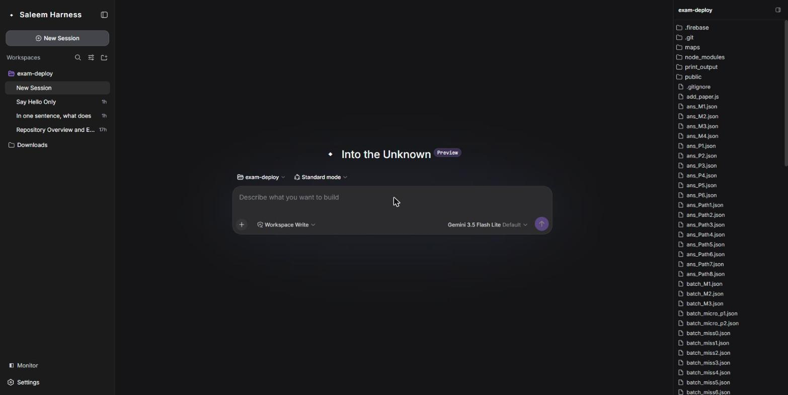
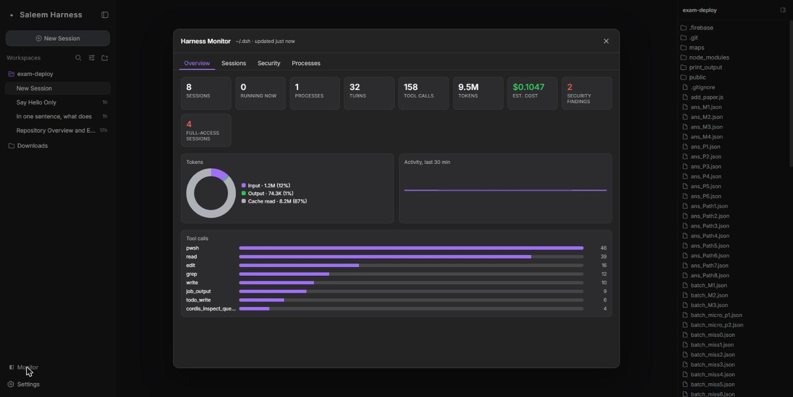
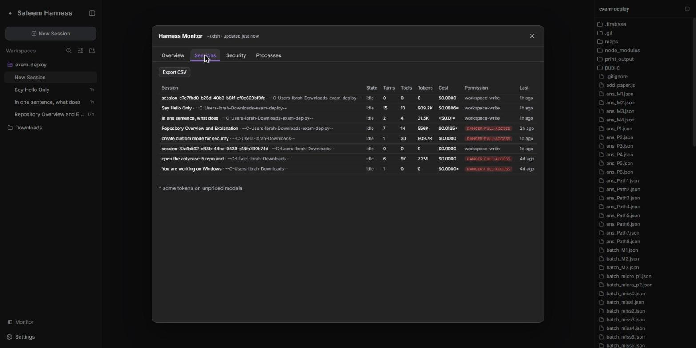
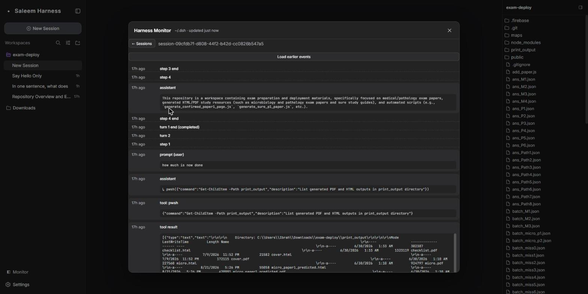
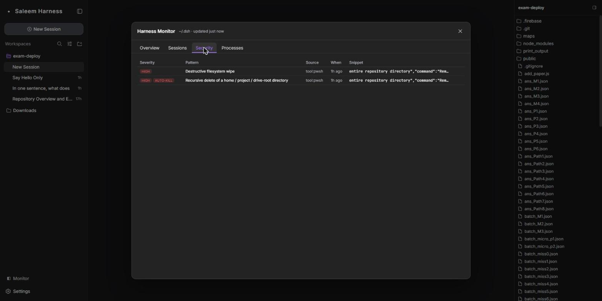
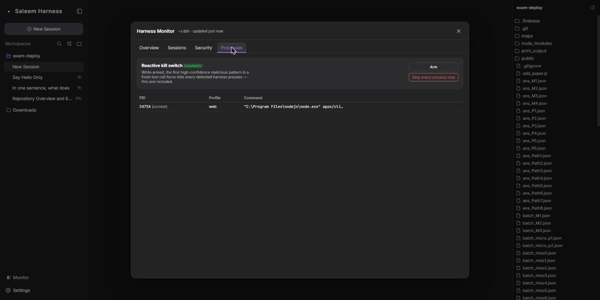

# Saleem Harness

A personalized coding-agent CLI (`saleem`) and web UI, built on an architecture where
**everything is a plugin** and powered by [Cordis](https://github.com/cordiverse/cordis)
(design: [_A Programming Paradigm for Spatiotemporal Composability_](https://github.com/cordiverse/paper)).
It ships a preventive tool-call safety guard active by default
(`packages/guard/tool-guard-saleem/`) and a built-in observability panel, the **Harness
Monitor**.



## Developer preview

Currently in _developer preview_ and iterating rapidly. **THERE WILL BE
COMPATIBILITY-BREAKING CHANGES.**

<a id="run-from-source"></a>

## Run

Build from source, then run alongside (not replacing) any other harness install on the
same machine:

```sh
pnpm install
pnpm run build
cd apps/cli
npm link
```

```sh
saleem web
```

Starts the web UI at `http://127.0.0.1:3080` by default and opens it in the browser for
a local launch. Pass `--no-open` to run the server without opening a browser. User data
(session logs, settings, credentials) lives under `~/.dsh`.

## Features

### Web UI

A single-page workspace for running the agent:

- **Sessions & workspaces** — a session list grouped by workspace directory, with New
  Session, search, and per-session titles.
- **Chat & Trajectory views** — the conversation, or a step-by-step trajectory of every
  turn, tool call, and result.
- **Workspace file tree** — a read-only, lazily-expanding view of the active workspace's
  files on the right; it refetches when you switch to a session in another workspace.
- **Model & effort picker** — choose the provider/model and reasoning effort per
  session; the default (`google/gemini-3.5-flash-lite`) is marked _Default_.
- **Access mode** — Workspace Write / Full access / read-only, per session.

### Harness Monitor

A full-viewport observability panel, opened from **Monitor** at the sidebar foot. It
reads `~/.dsh` on a short poll plus an OS process scan — **no plugin in your sessions,
no configuration** — and turns it into a live dashboard across every session, subagent,
and workspace. Four tabs:

#### Overview

Headline stats (sessions, running agents, harness processes, turns, tool calls, total
tokens, estimated cost, security findings, full-access sessions), a token-composition
donut, an activity-per-minute sparkline for the last 30 minutes, and a tool-call
breakdown by name. Charts are hand-rolled inline SVG — no charting dependency.



#### Sessions

Every session in a table: state (running / idle), turns, tool calls, tokens, **estimated
cost** (weighted across the models a session used, with Gemini 3.x and OpenRouter rates
built in; unpriced models are marked `*`, never silently costed at $0), permission-risk
badge, and last activity. **Export CSV**, and click any row to open its drill-down.



#### Session drill-down

A readable, paginated timeline for one session — prompts, tool calls with arguments and
results, permission changes, turn/step boundaries as thin dividers — reduced from the
raw streaming event log. "Load earlier events" pages backward with a keyset cursor.



#### Security

A heuristic scanner runs ~17 regex rules over **every prompt and every tool-call
argument** in the logs, flagging destructive filesystem ops, `curl | sh`-style
pipe-to-shell, credential dumping, reverse shells, secret literals, persistence
mechanisms, ransomware-style shadow-copy deletion, and more — each with a severity and a
context snippet.



#### Processes & the reactive kill switch

Every detected `saleem` process (all profiles), and a toggle that arms a watchdog: the
instant a **high-confidence** malicious pattern shows up in a fresh tool call, it
force-kills every detected harness process — **this one included** (the Monitor runs
inside the process it observes, so there is no "outside" to stand on). There is also a
manual "Stop every process now" button.



Be clear-eyed about what this is: it is **reactive, not preventive**. It can only act
after the harness has already logged a tool call to disk, so a fast single-shot command
may finish before the kill lands — treat it as a fast circuit breaker, not a guarantee.
Ten of the ~17 rules auto-kill; the rest (including a bare recursive delete like
`rm -rf node_modules`) are flagged only. One rule, `wide-recursive-delete`, auto-kills a
`rm -rf` / `Remove-Item -Recurse -Force` **only** when the target is a filesystem root, a
home directory, or a project directly under a user profile / Downloads / Desktop /
Documents / OneDrive.

### Models

The provider catalog is a curated set of current **Gemini 3.x** chat models
(`gemini-3.6-flash`, `gemini-3.5-flash`, `gemini-3.5-flash-lite`, `gemini-3.1-flash-lite`,
`gemini-3.1-pro-preview`, `gemini-2.5-pro`, `gemini-2.5-flash`) plus OpenRouter routes.
Any other provider (Anthropic, OpenAI, a local endpoint, …) can be added from **Settings
→ Models**, which writes `~/.dsh/settings.yaml`.

### Safety

Three independent layers: the preventive **tool-guard** (`tool-guard-saleem`, active by
default, denies a short list of high-confidence malicious commands _before_ dispatch),
**permission presets** (per-session Workspace Write / Full access / read-only with an
approval policy), and the Monitor's reactive **kill switch** above.

## Development

Start with the [development guide](docs/development.md) and
[architecture documentation](docs/architecture.md).

For agents, follow [AGENTS.md](AGENTS.md).

## License

[MIT](LICENSE)

Third-party dependencies and their licenses are disclosed in
[THIRD_PARTY_NOTICES.md](THIRD_PARTY_NOTICES.md).
